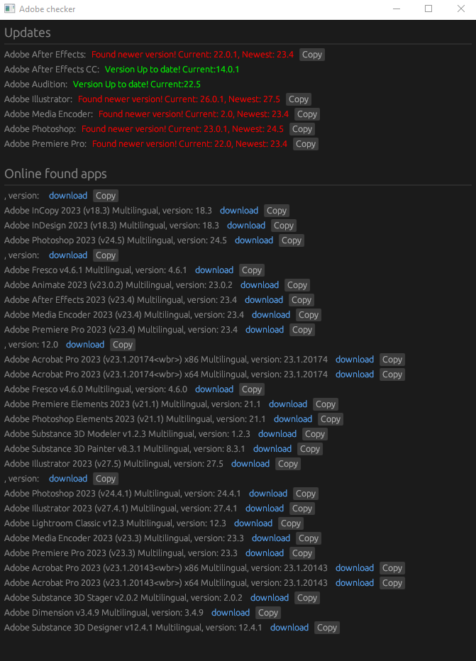

# M0nkrus Adobe Tracker

Check locally installed Adobe app updates and find M0nkrus magnets for downloads and provides downloads for other Adobe apps not installed.

## Features

- Check for updates for locally installed Adobe apps and find M0nkrus magnets for updates and downloads for other Adobe apps
- Run in the system tray for easy access
- Send Windows notifications for updates
- Run on boot

## How it works

1. Find installed Adobe apps and their versions from the Windows registry.
2. Fetch the latest versions from RuTracker.
3. Compare the versions and show the update information and magnet links.

## How to install from source

1. Install Rust [here](https://www.rust-lang.org/tools/install)
2. Run `cargo build --release` in the source folder
3. Release build can be found `./target/release/M0nkrus-Adobe-Tracker.exe`

## License

This project is licensed under the GNU General Public License v3.0 License - see the [LICENSE](LICENSE) file for details.
